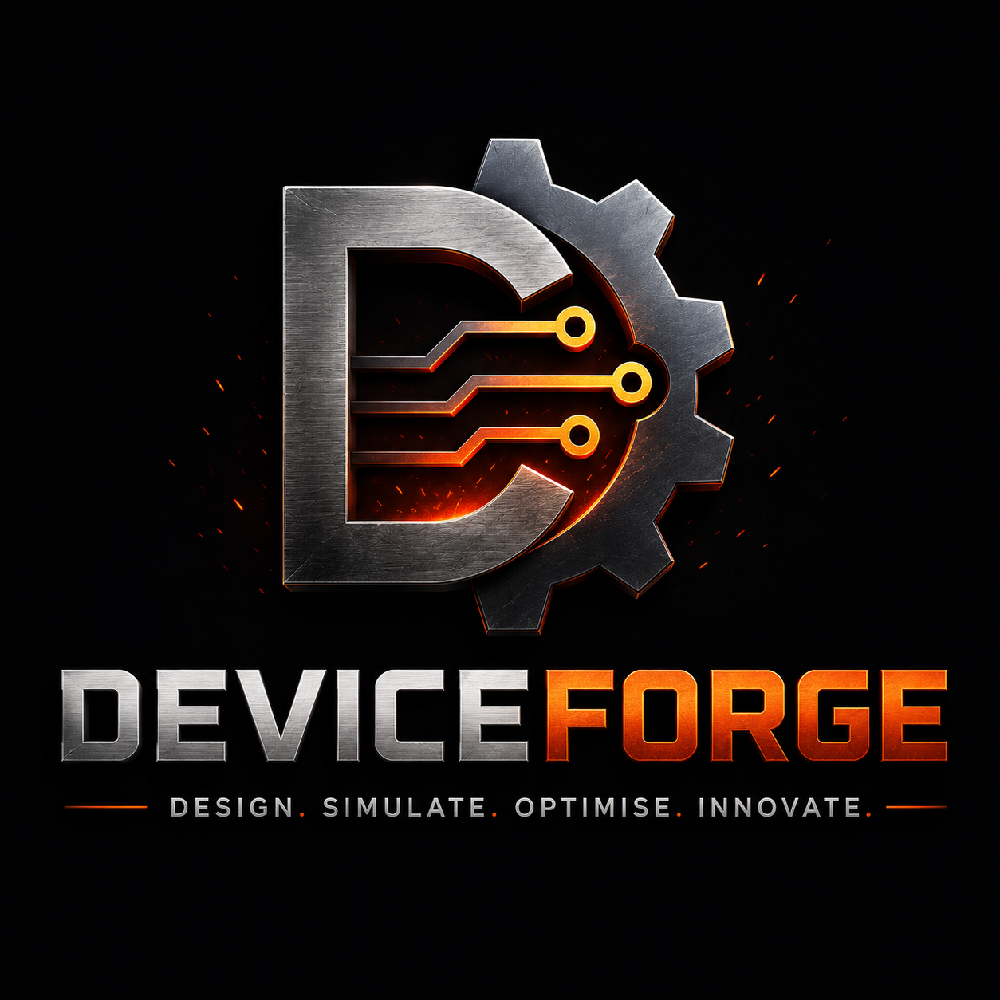

# DeviceForge

------------------------------------------------------------------------


Scientific Computing • Semiconductor Physics • Numerical Methods •
High-Performance Computing • Machine Learning • Engineering Optimisation

------------------------------------------------------------------------

# Overview

**DeviceForge** is an open-source **Technology Computer-Aided Design
(TCAD)** framework for semiconductor device simulation. The project
explores how modern semiconductor simulation software can be developed
using transparent numerical methods, rigorous verification, and
contemporary scientific software engineering practices.

The framework combines:

-   Semiconductor Physics
-   Numerical Analysis
-   Scientific Computing
-   High-Performance Computing
-   Software Engineering
-   Machine Learning
-   Engineering Optimisation

Unlike many educational simulation projects, DeviceForge places equal
emphasis on:

-   Numerical correctness
-   Independent verification
-   Scientific reproducibility
-   Modular software architecture
-   Automated testing
-   Long-term extensibility

The long-term vision is to develop DeviceForge into a modular research
platform capable of supporting semiconductor transport simulation, GPU
acceleration, machine-learning-assisted optimisation and interactive
engineering workflows.

------------------------------------------------------------------------

# Why DeviceForge?

Commercial semiconductor TCAD software provides exceptional simulation
capability but often functions as a black box.

DeviceForge investigates **how semiconductor simulators are built**
using transparent numerical methods and modern software engineering.

The project serves four primary goals:

## Scientific Computing

Develop robust numerical algorithms for coupled nonlinear semiconductor
equations.

## Engineering Software

Explore maintainable software architecture for long-term scientific
computing.

## Research

Provide a flexible platform for semiconductor physics, optimisation and
HPC research.

## Education

Create an accessible implementation of modern TCAD algorithms suitable
for learning and experimentation.

------------------------------------------------------------------------

# Current Development Status

> **Current Status**
>
> DeviceForge includes validated electrostatic solvers together with a
> verified one-dimensional self-consistent semiconductor
> drift--diffusion solver.
>
> Current development is focused on voltage sweeps, current--voltage
> characteristics, advanced semiconductor physics, two-dimensional
> simulation, GPU acceleration and engineering optimisation.

------------------------------------------------------------------------

# Current Capabilities

## Semiconductor Physics

-   ✅ Structured finite-difference computational grids
-   ✅ Material framework
-   ✅ Region framework
-   ✅ Donor and acceptor doping
-   ✅ Dirichlet and Neumann boundary conditions
-   ✅ Laplace equation
-   ✅ Poisson equation
-   ✅ Nonlinear equilibrium semiconductor solver
-   ✅ Self-consistent Gummel drift--diffusion solver
-   ✅ Scharfetter--Gummel discretisation
-   ✅ Shockley--Read--Hall recombination
-   ✅ Electron continuity equation
-   ✅ Hole continuity equation
-   ✅ Electron, hole and total current density

## Numerical Verification

-   ✅ Analytical benchmark comparison
-   ✅ Mesh convergence studies
-   ✅ Regression testing
-   ✅ Unit testing
-   ✅ Current conservation diagnostics
-   ✅ Continuity-equation diagnostics
-   ✅ Algebraic residual verification
-   ✅ Cross-validation between independent implementations

## Software Engineering

-   ✅ Modular object-oriented architecture
-   ✅ Typed Python implementation
-   ✅ Backend-independent design
-   ✅ Automated testing framework
-   ✅ Verification framework

Future backends:

-   📋 Modern C++
-   📋 OpenMP
-   📋 CUDA
-   📋 AMD ROCm
-   📋 Distributed Computing

------------------------------------------------------------------------

# Feature Matrix

  Capability                           Status
  ----------------------------------- --------
  Laplace Solver                         ✅
  Poisson Solver                         ✅
  Equilibrium Solver                     ✅
  Drift--Diffusion Solver                ✅
  Current Conservation Verification      ✅
  Automated Test Suite                   ✅
  Voltage Sweep Framework                🚧
  Current--Voltage Characteristics       🚧
  Two-Dimensional TCAD                   📋
  GPU Acceleration                       📋
  Machine Learning                       📋

------------------------------------------------------------------------

# Design Philosophy

DeviceForge follows a verification-first engineering philosophy.

Core principles:

-   Numerical correctness before optimisation
-   Verification before performance
-   Modular architecture
-   Scientific reproducibility
-   Automated testing
-   Extensible design

Every new numerical method should include documentation, unit tests,
verification and validation examples before becoming part of the
production framework.

------------------------------------------------------------------------

# Quick Start

``` bash
git clone https://github.com/John-McKay-Engineering-Research/DeviceForge.git
cd DeviceForge
python -m venv .venv
```

Windows:

``` powershell
.venv\Scripts\activate
```

Linux/macOS:

``` bash
source .venv/bin/activate
```

``` bash
pip install -e .
python -m pytest
python examples/laplace_rectangle.py
```

------------------------------------------------------------------------

# Demonstrations

Current demonstrations include:

1.  Laplace Equation
2.  Poisson Equation
3.  Fixed-Charge PN Junction
4.  Equilibrium Semiconductor Solver
5.  Self-Consistent Drift--Diffusion Solver

The following sections describe each demonstration in detail.

------------------------------------------------------------------------

# Demonstrations

The examples below demonstrate the current numerical capabilities of
DeviceForge. Each example has been developed alongside analytical
validation, automated testing and numerical verification.

------------------------------------------------------------------------

# Demonstration Gallery

The current examples progress from classical electrostatics through to
fully self-consistent semiconductor transport.

  Demonstration                  Purpose
  ------------------------------ ----------------------------------------
  Laplace Equation               Electrostatic benchmark
  Poisson Equation               Fixed charge electrostatics
  Fixed-Charge PN Junction       Semiconductor electrostatics
  Equilibrium PN Junction        Nonlinear Poisson with mobile carriers
  Drift--Diffusion PN Junction   Coupled transport simulation

------------------------------------------------------------------------

# Self-Consistent Drift--Diffusion PN Junction

The flagship example within DeviceForge is a one-dimensional
self-consistent drift--diffusion solver using damped Gummel iteration.

Implemented physics includes:

-   Nonlinear Poisson equation
-   Electron continuity equation
-   Hole continuity equation
-   Scharfetter--Gummel discretisation
-   Shockley--Read--Hall recombination
-   Electron current density
-   Hole current density
-   Total current density

The implementation also includes independent numerical verification
through:

-   Current conservation diagnostics
-   Continuity equation diagnostics
-   Algebraic residual verification
-   Mesh convergence studies
-   Automated regression tests

Typical outputs include:

-   Electrostatic potential
-   Electron concentration
-   Hole concentration
-   Current density
-   Recombination profile
-   Solver convergence history


------------------------------------------------------------------------

# Equilibrium PN Junction

The equilibrium solver couples electrostatic potential with mobile
carrier concentrations to compute the built-in junction potential.

Outputs include:

-   Potential
-   Carrier concentrations
-   Space-charge density
-   Built-in electric field

``` bash
python examples/pn_junction_equilibrium.py
```


------------------------------------------------------------------------

# Fixed-Charge PN Junction

This demonstration illustrates semiconductor electrostatics using fixed
donor and acceptor doping.

Visualisations include:

-   Doping profile
-   Charge density
-   Electrostatic potential
-   Electric field
-   Centre-line profiles

``` bash
python examples/pn_junction_fixed_charge.py
```

------------------------------------------------------------------------

# Two-Dimensional Poisson Solver

The Poisson example extends the Laplace formulation by introducing fixed
semiconductor charge.

Example outputs:

-   Potential
-   Electric field
-   Analytical comparison
-   Solver convergence

``` bash
python examples/poisson_uniform_charge.py
```

------------------------------------------------------------------------

# Two-Dimensional Laplace Solver

The Laplace solver provides the electrostatic foundation for DeviceForge
and serves as an analytical benchmark.

Outputs include:

-   Potential contours
-   Electric-field magnitude
-   Electric-field vectors
-   Solver convergence

``` bash
python examples/laplace_rectangle.py
```

------------------------------------------------------------------------

# Iterative Solver Benchmarks

DeviceForge includes benchmarking utilities comparing classical
iterative methods.

Current comparisons include:

-   Jacobi
-   Gauss--Seidel
-   Successive Over-Relaxation (SOR)

Metrics:

-   Runtime
-   Iteration count
-   Convergence history
-   Numerical error

``` bash
python benchmarks/compare_iterative_solvers.py
```

------------------------------------------------------------------------

# Summary

These demonstrations form a progression from classical electrostatics to
modern semiconductor transport simulation.

Future demonstrations will include:

-   Voltage sweeps
-   Current--voltage (I--V) characteristics
-   MOS capacitors
-   MOSFETs
-   FinFETs
-   Two-dimensional drift--diffusion
-   Electro-thermal coupling

------------------------------------------------------------------------

# Architecture

DeviceForge has been designed around a modular, extensible architecture
that separates semiconductor physics from numerical algorithms and
software infrastructure.

------------------------------------------------------------------------

# Architectural Principles

The framework is built around several guiding principles:

-   Separation of physics from implementation
-   Independent, reusable solver components
-   Backend-independent numerical kernels
-   Verification-first development
-   Extensibility for future research

------------------------------------------------------------------------

# Project Structure

``` text
deviceforge/
├── core/
├── geometry/
├── physics/
├── solvers/
├── postprocessing/
├── visualisation/
├── optimisation/
├── io/
└── utils/
```

Each package has a clearly defined responsibility, making it possible to
extend one part of the framework without affecting the rest.

------------------------------------------------------------------------

# Core Components

## Grid

Defines structured computational grids, spacing, indexing and coordinate
transforms.

## Materials

Stores semiconductor material properties such as:

-   Permittivity
-   Mobility
-   Intrinsic carrier concentration
-   Bandgap
-   Electron affinity

## Regions

Represents geometric regions and associates them with material
definitions.

## Device

Aggregates regions, doping profiles, contacts and boundary conditions
into a complete simulation model.

------------------------------------------------------------------------

# Physics Layer

The physics layer contains reusable implementations of semiconductor
models including:

-   Poisson equation
-   Drift--diffusion transport
-   Carrier statistics
-   Recombination models
-   Current density calculations

Future additions include:

-   Band-gap narrowing
-   Mobility degradation
-   Velocity saturation
-   Quantum corrections
-   Electro-thermal coupling

------------------------------------------------------------------------

# Solver Layer

The solver layer contains the numerical algorithms used to solve the
governing equations.

Current solvers include:

-   Laplace
-   Poisson
-   Nonlinear equilibrium
-   Gummel iteration

Planned additions include:

-   Newton--Raphson
-   Multigrid
-   Krylov methods
-   Adaptive mesh refinement

------------------------------------------------------------------------

# Visualisation

DeviceForge produces publication-quality visualisations including:

-   Potential
-   Electric field
-   Carrier concentrations
-   Current density
-   Recombination
-   Convergence history

Future plans include an interactive GUI for simulation setup and result
exploration.

------------------------------------------------------------------------

# Optimisation Roadmap

Long-term optimisation capabilities include:

-   Parameter sweeps
-   Design of experiments
-   Sensitivity analysis
-   Gradient-free optimisation
-   Bayesian optimisation
-   Machine-learning-assisted optimisation

------------------------------------------------------------------------

# High-Performance Computing

The software is intentionally designed to support multiple computational
backends.

Planned acceleration technologies include:

-   Modern C++
-   OpenMP
-   NVIDIA CUDA
-   AMD ROCm
-   Distributed computing
-   Multi-GPU execution

This separation allows numerical algorithms to remain largely
independent of the execution backend.

------------------------------------------------------------------------

# Software Quality

Every major component is expected to include:

-   Documentation
-   Unit tests
-   Numerical verification
-   Regression tests
-   Example problems

This verification-first philosophy ensures long-term maintainability and
scientific reproducibility.

------------------------------------------------------------------------

# Looking Ahead

As DeviceForge evolves, the architecture will support:

-   Two-dimensional TCAD
-   Three-dimensional TCAD
-   Transient simulation
-   Electro-thermal coupling
-   GPU-native solvers
-   AI-assisted device optimisation

The objective is to provide a modern, research-oriented semiconductor
simulation framework that remains transparent, extensible and
scientifically rigorous.

------------------------------------------------------------------------

# Numerical Methods

DeviceForge implements the governing equations of semiconductor device
physics using transparent numerical methods designed for accuracy,
verification and future extensibility.

------------------------------------------------------------------------

# Governing Equations

The framework is built around the coupled semiconductor drift--diffusion
equations:

1.  Poisson equation
2.  Electron continuity equation
3.  Hole continuity equation

Together these describe the electrostatic potential, carrier transport
and current flow within semiconductor devices.

------------------------------------------------------------------------

# Poisson Equation

The electrostatic potential is obtained by solving Poisson's equation
using finite-difference discretisation.

The charge density includes:

-   Electrons
-   Holes
-   Ionised donors
-   Ionised acceptors

Poisson's equation forms the backbone of every DeviceForge simulation.

------------------------------------------------------------------------

# Carrier Statistics

DeviceForge currently employs classical carrier statistics to compute
equilibrium electron and hole concentrations.

Implemented concepts include:

-   Intrinsic carrier concentration
-   Fermi potential
-   Built-in potential
-   Charge neutrality
-   Thermal equilibrium

Future work will introduce:

-   Fermi--Dirac statistics
-   Degenerate semiconductors
-   Band-gap narrowing

------------------------------------------------------------------------

# Drift--Diffusion Transport

Carrier transport is modelled using the classical drift--diffusion
formulation.

Each carrier current consists of:

-   Drift due to electric field
-   Diffusion due to concentration gradients

Current calculations are performed consistently throughout the
computational domain.

------------------------------------------------------------------------

# Scharfetter--Gummel Discretisation

DeviceForge uses the Scharfetter--Gummel exponential fitting scheme to
discretise the continuity equations.

Advantages include:

-   Excellent numerical stability
-   Accurate current conservation
-   Robust performance for strong electric fields
-   Industry-standard formulation

This approach forms the foundation of most commercial TCAD tools.

------------------------------------------------------------------------

# Gummel Iteration

The nonlinear semiconductor equations are solved using damped Gummel
iteration.

Each iteration performs:

1.  Solve Poisson equation
2.  Update electron concentration
3.  Update hole concentration
4.  Compute residuals
5.  Check convergence

The process repeats until the prescribed convergence tolerance is
satisfied.

------------------------------------------------------------------------

# Boundary Conditions

Supported boundary conditions include:

-   Dirichlet
-   Neumann

Future releases will include:

-   Ohmic contacts
-   Schottky contacts
-   Mixed boundary conditions
-   Interface models

------------------------------------------------------------------------

# Linear Solvers

Current implementations include iterative finite-difference solvers
suitable for structured grids.

Planned solver technologies include:

-   Conjugate Gradient
-   GMRES
-   BiCGSTAB
-   Algebraic Multigrid
-   Sparse direct solvers

------------------------------------------------------------------------

# Numerical Stability

DeviceForge incorporates several techniques to improve robustness:

-   Residual monitoring
-   Damping
-   Current conservation checks
-   Mesh convergence studies
-   Regression testing

These diagnostics are used throughout development to verify numerical
correctness.

------------------------------------------------------------------------

# Future Physics

The numerical framework has been designed to accommodate increasingly
sophisticated semiconductor models.

Planned additions include:

-   Field-dependent mobility
-   Velocity saturation
-   Auger recombination
-   Trap-assisted transport
-   Quantum corrections
-   Electro-thermal coupling
-   Transient simulation
-   Three-dimensional device simulation

------------------------------------------------------------------------

# Scientific Philosophy

The emphasis of DeviceForge is not simply producing simulation results,
but understanding and verifying the algorithms that generate them.

Every numerical model is expected to be:

-   Documented
-   Tested
-   Verified
-   Validated
-   Reproducible

This philosophy aims to make DeviceForge a valuable platform for both
semiconductor research and scientific software engineering.

------------------------------------------------------------------------

# Verification, Validation and Testing

DeviceForge adopts a verification-first development philosophy. Every
numerical feature is expected to be accompanied by automated tests,
numerical verification and documented validation before it is considered
complete.

------------------------------------------------------------------------

# Verification Strategy

Verification answers the question:

> **"Are we solving the equations correctly?"**

Current verification activities include:

-   Analytical benchmark comparison
-   Mesh convergence studies
-   Conservation checks
-   Residual monitoring
-   Cross-validation with independent implementations
-   Automated regression testing

------------------------------------------------------------------------

# Validation Strategy

Validation answers the complementary question:

> **"Are we solving the correct equations for the intended physical
> problem?"**

As DeviceForge evolves, validation will increasingly compare simulation
results against:

-   Published benchmark problems
-   Academic literature
-   Experimental measurements
-   Commercial TCAD reference solutions where appropriate

------------------------------------------------------------------------

# Automated Testing

DeviceForge includes a growing automated test suite covering the major
software components.

Current tests verify:

-   Grid generation
-   Material definitions
-   Regions
-   Devices
-   Boundary conditions
-   Field objects
-   Solver behaviour
-   Numerical utilities

The objective is that every pull request can be checked automatically to
detect regressions.

------------------------------------------------------------------------

# Numerical Diagnostics

Each solver reports diagnostic information that assists with
verification and debugging.

Typical diagnostics include:

-   Residual history
-   Iteration count
-   Convergence tolerance
-   Current conservation error
-   Maximum update magnitude
-   Runtime statistics

These outputs make solver behaviour transparent and reproducible.

------------------------------------------------------------------------

# Mesh Convergence

Numerical accuracy should improve as the computational mesh is refined.

Future documentation will include convergence studies demonstrating:

-   Potential convergence
-   Electric-field convergence
-   Carrier-density convergence
-   Current-density convergence

------------------------------------------------------------------------

# Regression Testing

Regression testing ensures that new features do not unintentionally
alter existing behaviour.

Typical regression tests compare:

-   Numerical solutions
-   Residual histories
-   Solver iteration counts
-   Output files
-   Benchmark metrics

------------------------------------------------------------------------

# Continuous Integration

As DeviceForge grows, automated CI workflows will execute:

-   Static analysis
-   Code formatting
-   Unit tests
-   Numerical benchmark problems
-   Documentation checks

This provides rapid feedback when changes are introduced.

------------------------------------------------------------------------

# Code Quality

The project aims to follow modern scientific software engineering
practices, including:

-   Modular design
-   Clear documentation
-   Type hints
-   Consistent coding standards
-   Comprehensive test coverage

------------------------------------------------------------------------

# Performance Benchmarking

Future benchmarking will compare:

-   CPU backends
-   GPU backends
-   Solver scalability
-   Parallel efficiency
-   Memory usage
-   Strong and weak scaling

These benchmarks will guide future optimisation work.

------------------------------------------------------------------------

# Future Validation Roadmap

Planned validation activities include:

-   MOS capacitor benchmarks
-   PN-junction reference problems
-   MOSFET transfer characteristics
-   FinFET benchmark devices
-   Electro-thermal verification
-   Three-dimensional validation studies

------------------------------------------------------------------------

# Summary

Verification, validation and testing are treated as integral parts of
DeviceForge rather than afterthoughts. The long-term objective is to
provide confidence that every numerical result produced by the framework
is scientifically reliable, reproducible and fully traceable.

------------------------------------------------------------------------

# Roadmap

DeviceForge is intended to evolve from a research-focused educational
TCAD framework into a modern semiconductor simulation platform capable
of supporting advanced numerical methods, high-performance computing and
AI-assisted engineering optimisation.

------------------------------------------------------------------------

# Development Roadmap

## Short Term

Current priorities include:

-   Voltage sweep capability
-   Current--voltage (I--V) characteristics
-   MOS capacitor simulation
-   Two-dimensional Poisson solver
-   Improved plotting and visualisation
-   Expanded documentation
-   Continuous Integration workflows

## Medium Term

Planned developments include:

-   Two-dimensional drift--diffusion
-   Newton-based nonlinear solvers
-   Sparse linear algebra
-   Adaptive mesh refinement
-   GPU acceleration (CUDA and ROCm)
-   Parameter studies
-   Sensitivity analysis

## Long Term

The long-term vision includes:

-   Three-dimensional TCAD
-   Electro-thermal simulation
-   Process simulation
-   AI-assisted device optimisation
-   Distributed HPC execution
-   Interactive graphical interface
-   Plugin architecture for custom physics models

------------------------------------------------------------------------

# Contributing

Contributions are welcome.

Areas where contributions will be especially valuable include:

-   Semiconductor physics
-   Numerical methods
-   Scientific computing
-   GPU programming
-   Documentation
-   Testing and verification
-   Visualisation
-   Performance optimisation

When contributing, please:

1.  Create a feature branch.
2.  Include unit tests where appropriate.
3.  Document new functionality.
4.  Verify numerical correctness.
5.  Submit a pull request for review.

------------------------------------------------------------------------

# Coding Standards

DeviceForge aims to follow modern scientific software engineering
practices.

General guidelines include:

-   Clear, readable code
-   Descriptive variable names
-   Type hints where appropriate
-   Small, reusable components
-   Comprehensive documentation
-   Automated testing

Correctness and maintainability are prioritised over premature
optimisation.

------------------------------------------------------------------------

# Citation

If DeviceForge contributes to your research, please consider citing the
project.

A formal citation and DOI will be added when the project reaches its
first stable public release.

Example placeholder:

``` text
McKay, J.
DeviceForge: An Open-Source Semiconductor TCAD Framework.
GitHub (2026).
```

------------------------------------------------------------------------

# Recommended Reading

The following references have strongly influenced the numerical methods
and scientific philosophy behind DeviceForge:

-   Selberherr --- *Analysis and Simulation of Semiconductor Devices*
-   Sze & Ng --- *Physics of Semiconductor Devices*
-   Lundstrom --- *Fundamentals of Carrier Transport*
-   Press et al. --- *Numerical Recipes*
-   Saad --- *Iterative Methods for Sparse Linear Systems*

------------------------------------------------------------------------

# Licence

DeviceForge is released under the MIT License.

See the `LICENSE` file for complete licensing information.

------------------------------------------------------------------------

# Acknowledgements

DeviceForge has been inspired by decades of research in:

-   Semiconductor device physics
-   Numerical analysis
-   Scientific computing
-   High-performance computing
-   Open-source engineering software

The project also draws upon knowledge developed through doctoral
research in computational engineering, finite element analysis,
optimisation and scientific software development.

------------------------------------------------------------------------


# High-Performance Computing, GPU Acceleration & AI Optimisation

DeviceForge has been designed with a long-term vision that extends
beyond a traditional educational TCAD solver. The architecture is
intended to support high-performance computing (HPC), heterogeneous
hardware, and AI-assisted engineering workflows while preserving
numerical transparency and scientific reproducibility.

------------------------------------------------------------------------

# Why High-Performance Computing?

Semiconductor device simulation is computationally demanding. As device
complexity, mesh resolution and physical models increase, computational
cost can grow dramatically.

High-performance computing enables:

-   Faster simulation turnaround
-   Larger device models
-   Higher mesh resolutions
-   Parameter sweeps
-   Design-space exploration
-   Multi-physics coupling

The objective is to make advanced simulations practical on both desktop
workstations and compute clusters.

------------------------------------------------------------------------

# Backend Philosophy

DeviceForge separates numerical algorithms from execution backends.

This allows the same mathematical formulation to target multiple
hardware platforms without changing the underlying physics.

Planned execution backends include:

-   Python (research and rapid prototyping)
-   Modern C++ (high-performance kernels)
-   OpenMP (multi-core CPUs)
-   NVIDIA CUDA
-   AMD ROCm
-   Distributed-memory HPC

------------------------------------------------------------------------

# CPU and GPU Computing

Different workloads benefit from different hardware.

CPU execution is often advantageous for:

-   Small simulation domains
-   Low-latency iterative development
-   Complex control flow
-   Debugging and verification

GPU execution becomes increasingly beneficial for:

-   Large meshes
-   Repeated parameter studies
-   Dense numerical kernels
-   Massive parallelism
-   Optimisation workflows

A long-term goal is to estimate computational workload before execution
and recommend the most appropriate backend automatically.

------------------------------------------------------------------------

# Numerical Precision

Scientific credibility requires careful treatment of numerical
precision.

Future backends will support:

-   FP64 (double precision)
-   FP32 (single precision)
-   Mixed-precision strategies where appropriate

Performance gains should never come at the expense of verified numerical
correctness.

------------------------------------------------------------------------

# Performance Optimisation

Future optimisation work will investigate:

-   Sparse matrix storage
-   Cache-aware algorithms
-   SIMD vectorisation
-   Efficient memory access patterns
-   Solver profiling
-   Reduced allocation overhead

Performance improvements will be guided by profiling and benchmark data
rather than premature optimisation.

------------------------------------------------------------------------

# Distributed Computing

Many engineering studies require thousands of simulations rather than
one extremely large simulation.

Future distributed capabilities may support:

-   Parameter sweeps
-   Monte Carlo studies
-   Optimisation campaigns
-   Design-of-experiments
-   Cluster execution
-   Cloud deployment

The framework is intended to scale from a laptop to multi-node compute
resources.

------------------------------------------------------------------------

# AI-Assisted Engineering

Machine learning has the potential to accelerate engineering workflows
by reducing the number of expensive numerical simulations.

Potential applications include:

-   Surrogate modelling
-   Bayesian optimisation
-   Sensitivity analysis
-   Design-space exploration
-   Automated parameter tuning
-   Intelligent sampling

These methods complement, rather than replace, first-principles physics
simulations.

------------------------------------------------------------------------

# Long-Term Vision

The long-term ambition for DeviceForge includes:

-   Two-dimensional TCAD
-   Three-dimensional TCAD
-   Electro-thermal coupling
-   Process simulation
-   GPU-native solvers
-   AI-assisted device optimisation
-   Interactive desktop application
-   Plugin architecture
-   Research-grade HPC workflows

------------------------------------------------------------------------


# Closing Remarks

DeviceForge is intended to demonstrate how modern semiconductor
simulation software can combine rigorous numerical methods,
high-performance computing, machine learning and contemporary software
engineering into a transparent and extensible research platform.

The project will continue to evolve incrementally, with new capabilities
added only after they have been implemented, tested and verified. This
engineering-first philosophy aims to ensure that DeviceForge remains
both scientifically credible and technically robust as it grows.

-----------------------------------------------------------------------

# Contact

Project Repository

``` text
https://github.com/John-McKay-Engineering-Research/DeviceForge
```

Issues, feature requests and discussions are welcome through the GitHub
repository.

------------------------------------------------------------------------