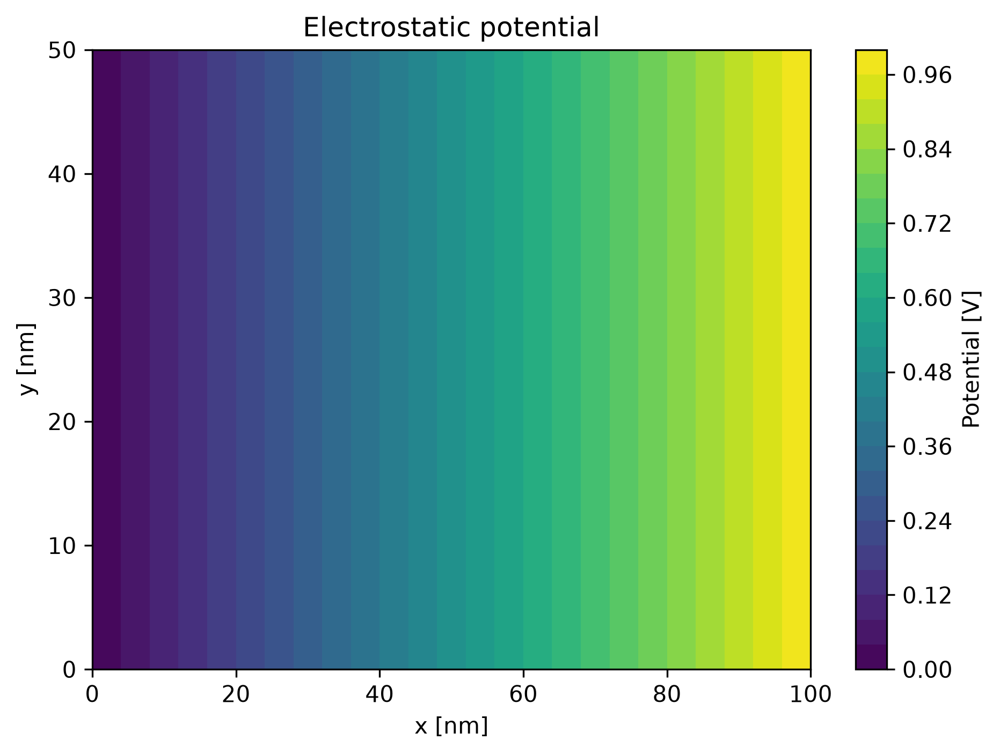
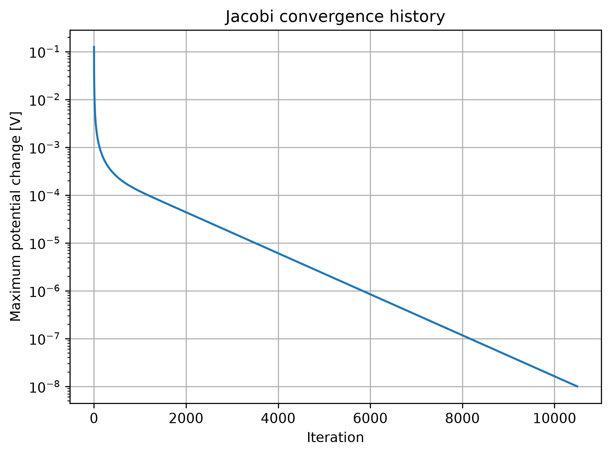
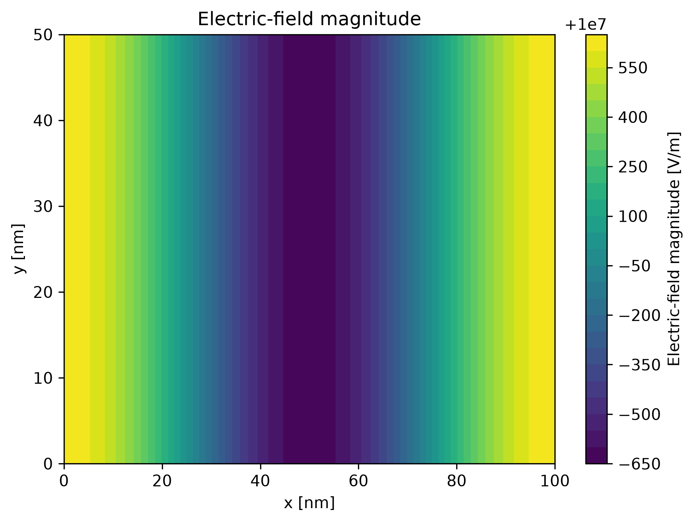
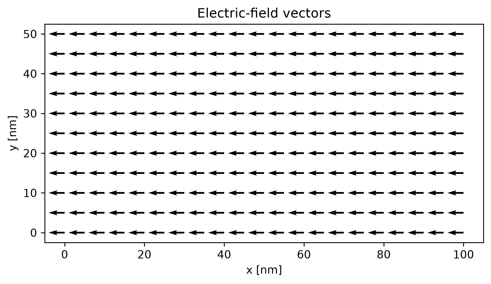
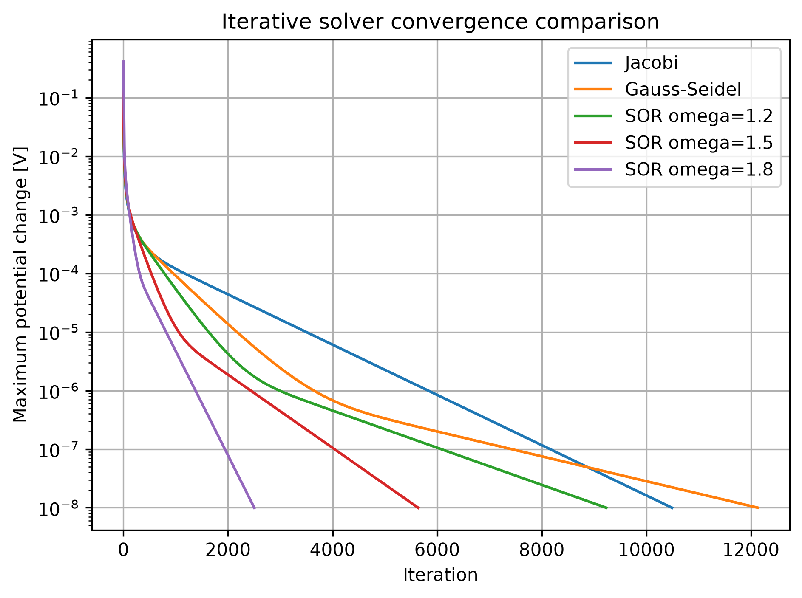
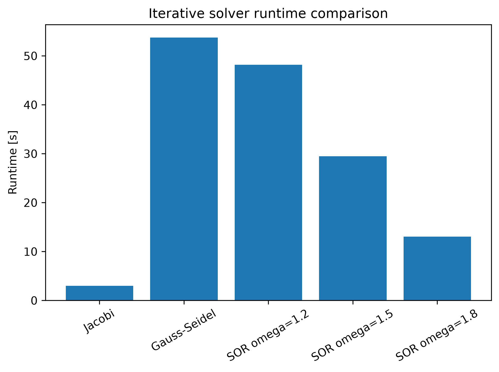
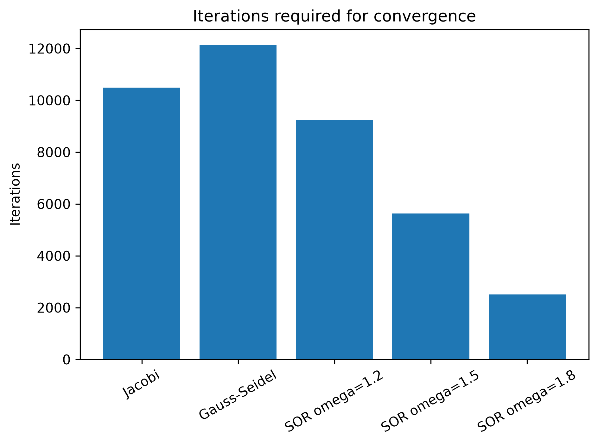
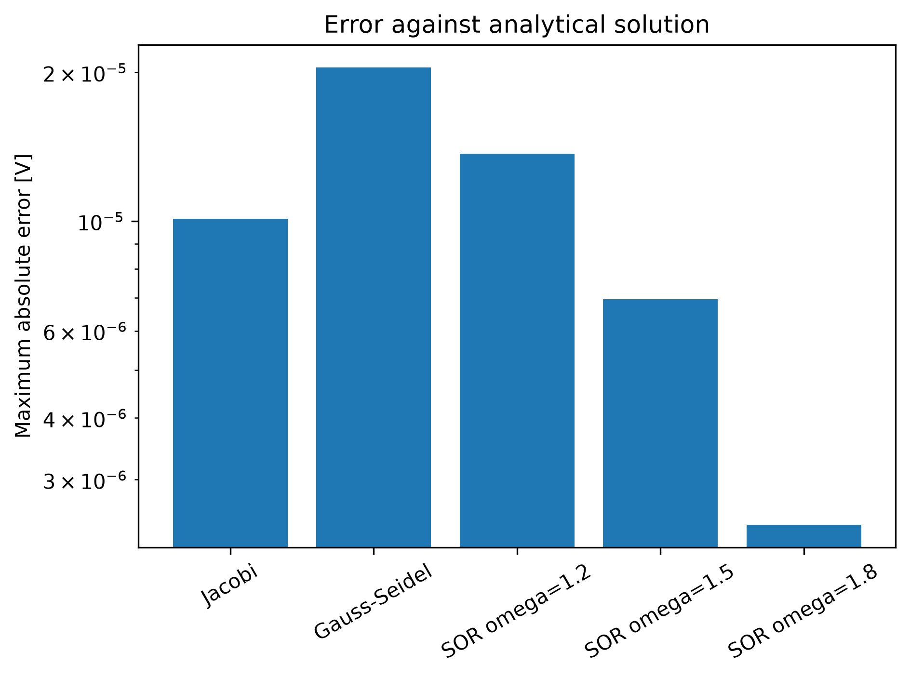

# DeviceForge

**An open-source framework for semiconductor device simulation, high-performance computing, machine learning and design optimisation.**

DeviceForge is a research-oriented engineering software project exploring the development of scalable numerical methods for semiconductor device simulation.

The initial release will focus on two-dimensional electrostatic device modelling using numerical partial differential equation solvers. The framework will then be extended with C++, OpenMP, CUDA, distributed parameter studies, machine-learning surrogate models and multi-objective optimisation.

The long-term aim is to create a modular platform for investigating how numerical simulation, high-performance computing and machine learning can be combined to accelerate semiconductor device design workflows.

---

## Current Demonstration

DeviceForge currently includes a validated two-dimensional Jacobi solver for the Laplace equation on structured Cartesian grids.

### Electrostatic Potential



### Solver Convergence



### Electric-Field Magnitude



### Electric-Field Direction



Run the example with:

```powershell
python examples/laplace_rectangle.py
```
## Iterative Solver Comparison

DeviceForge includes reproducible benchmarks comparing Jacobi, Gauss-Seidel
and Successive Over-Relaxation methods.

### Convergence



### Runtime



### Iteration Count



### Analytical Error



Run the benchmark with:

```powershell
python benchmarks/compare_iterative_solvers.py
```

## Project Status

DeviceForge is currently under active development.

The first development stage focuses on:

* Two-dimensional structured computational grids
* Electrostatic potential simulation
* Poisson and Laplace equation solvers
* Semiconductor material and doping regions
* Boundary-condition management
* Electric-field calculation
* Solver convergence analysis
* Scientific visualisation
* Validation against analytical benchmark problems

Later stages will introduce:

* C++ numerical solver backends
* OpenMP CPU parallelisation
* CUDA GPU acceleration
* Distributed simulation campaigns using MPI
* Machine-learning surrogate models
* Sensitivity analysis
* Multi-objective device optimisation
* Interactive visualisation and simulation tools
* Three-dimensional device simulation

---

## Project Motivation

Modern semiconductor Technology Computer-Aided Design workflows rely on numerical simulation to understand the behaviour of semiconductor devices before fabrication.

These simulations may involve:

* Strongly coupled partial differential equations
* Large sparse numerical systems
* Nonlinear material and transport models
* Fine spatial discretisation
* Repeated parameter studies
* Computationally expensive optimisation campaigns

DeviceForge is intended as an open research project for exploring these challenges using a combination of:

* Applied mathematics
* Semiconductor physics
* Scientific computing
* High-performance computing
* Parallel programming
* Machine learning
* Surrogate modelling
* Design optimisation

The project is not intended to reproduce the capabilities of commercial TCAD software. Instead, it provides a focused platform for implementing, validating and benchmarking selected numerical and computational methods used in semiconductor simulation.

---

## Planned Workflow

```text
Device Geometry and Parameters
              │
              ▼
      Semiconductor Model
              │
              ▼
    PDE Discretisation and Assembly
              │
              ▼
        Numerical Solver
              │
              ▼
   CPU / OpenMP / CUDA Backends
              │
              ▼
      Simulation Results
              │
              ▼
 Visualisation and Validation
              │
              ▼
 Distributed Dataset Generation
              │
              ▼
 Machine-Learning Surrogate Model
              │
              ▼
Sensitivity and Multi-Objective Optimisation
```

---

## Initial Two-Dimensional Scope

The first version of DeviceForge will solve electrostatic problems on structured two-dimensional grids.

The initial governing equation is the Poisson equation:

[
\nabla \cdot \left(\varepsilon \nabla \phi\right) = -\rho
]

where:

* (\phi) is the electrostatic potential
* (\varepsilon) is the material permittivity
* (\rho) is the charge density

For simplified semiconductor regions, the charge density may initially be represented using donor and acceptor doping concentrations:

[
\rho = q\left(N_D - N_A\right)
]

Later versions may include mobile electron and hole concentrations:

[
\rho = q\left(p - n + N_D - N_A\right)
]

The electrostatic potential will be used to calculate the electric field:

[
\mathbf{E} = -\nabla \phi
]

---

## Planned Numerical Methods

The initial solver development sequence will include:

1. Jacobi iteration
2. Gauss-Seidel iteration
3. Successive Over-Relaxation
4. Conjugate Gradient methods
5. Sparse matrix formulations
6. Nonlinear solution strategies for coupled models

The project will compare numerical methods using:

* Convergence rate
* Residual history
* Runtime
* Memory usage
* Mesh-size scaling
* Numerical accuracy

---

## Planned High-Performance Computing Features

DeviceForge will progressively introduce multiple execution backends.

### Python and NumPy

The initial implementation will provide a readable reference solver for numerical validation and rapid development.

### C++

Performance-critical numerical methods will be reimplemented in C++ using a modular solver interface.

### OpenMP

Shared-memory CPU parallelisation will be used to investigate multicore performance scaling.

### CUDA

GPU kernels will be developed for suitable structured-grid and linear-algebra operations.

### MPI

Distributed computing will initially be used for parallel simulation campaigns, dataset generation and optimisation evaluations.

Future work may explore distributed domain decomposition for larger simulations.

---

## Planned Machine-Learning Features

Machine learning will be used to approximate computationally expensive simulation outputs.

Planned surrogate-model inputs include:

* Device dimensions
* Doping concentrations
* Applied voltages
* Temperature
* Material properties
* Geometry parameters

Planned outputs include:

* Maximum electric field
* Average electric field
* Potential-based device metrics
* Convergence behaviour
* Simulation runtime
* Leakage and capacitance proxy values

Candidate surrogate models include:

* Multilayer perceptrons
* Gaussian-process regression
* Uncertainty-aware regression models
* Physics-informed machine-learning methods

The surrogate models will be validated against numerical simulation results using metrics such as:

* Mean Absolute Error
* Root Mean Squared Error
* Coefficient of determination
* Prediction latency
* Surrogate speed-up

---

## Planned Optimisation Features

DeviceForge will use simulation and surrogate models to perform semiconductor device design studies.

Planned methods include:

* Latin hypercube sampling
* Sobol sensitivity analysis
* Morris screening
* Bayesian optimisation
* NSGA-II multi-objective optimisation

Potential optimisation objectives include:

* Reducing peak electric-field concentration
* Reducing leakage proxy values
* Improving electrostatic control
* Reducing computational cost
* Balancing competing device-performance metrics

Results will be presented using Pareto fronts and before-and-after device comparisons.

---

## Planned Visual Outputs

DeviceForge will generate scientific and interactive outputs including:

* Device geometry plots
* Material-region maps
* Doping-profile maps
* Electrostatic potential heatmaps
* Electric-field magnitude maps
* Electric-field vector plots
* Solver residual histories
* CPU and GPU benchmark plots
* Parallel scaling plots
* Sensitivity-analysis charts
* Predicted-versus-simulated surrogate plots
* Pareto fronts
* Initial-versus-optimised device comparisons

An interactive application is planned to allow users to modify device parameters, run simulations and inspect results.

---

## Proposed Repository Structure

```text
DeviceForge/
├── src/
│   └── deviceforge/
│       ├── core/
│       ├── geometry/
│       ├── physics/
│       ├── discretisation/
│       ├── solvers/
│       ├── backends/
│       ├── postprocessing/
│       ├── visualisation/
│       ├── validation/
│       ├── machine_learning/
│       └── optimisation/
│
├── cpp/
│   ├── include/
│   ├── src/
│   └── cuda/
│
├── examples/
├── tests/
├── benchmarks/
├── docs/
├── notebooks/
├── app/
├── data/
├── figures/
└── scripts/
```

The Python package will provide the main user interface, simulation orchestration, machine-learning workflows and visualisation.

The C++ and CUDA components will provide performance-oriented numerical backends.

---

## Software Architecture

DeviceForge is being designed around several modular concepts.

### Grid

Defines the spatial discretisation, dimensions, spacing and computational domain.

### Field

Represents physical quantities defined over the grid, such as:

* Electrostatic potential
* Charge density
* Doping concentration
* Permittivity
* Electric-field components

### Material

Stores semiconductor and dielectric material properties.

### Region

Associates geometry, material properties and doping information with part of the computational domain.

### Boundary Condition

Represents Dirichlet, Neumann and future boundary-condition types.

### Physics Model

Defines the governing equations and physical source terms.

### Discretisation

Converts the continuous equations into a numerical form.

### Solver

Provides a common interface for different numerical solution methods.

### Compute Backend

Determines whether calculations are performed using NumPy, C++, OpenMP or CUDA.

### Simulation

Coordinates device construction, physics, discretisation, solution and post-processing.

### Simulation Result

Stores fields, convergence information, runtime data, solver metadata and derived metrics.

This separation is intended to make the project easier to validate, extend and eventually generalise from two-dimensional to three-dimensional simulations.

---

## Development Roadmap

### Phase 1 — Two-Dimensional Numerical Foundation

* Create structured-grid and field classes
* Implement boundary-condition handling
* Implement a NumPy Laplace solver
* Add Jacobi iteration
* Add convergence and residual tracking
* Validate against analytical benchmark problems
* Generate potential and electric-field visualisations

### Phase 2 — Semiconductor Electrostatics

* Add semiconductor materials
* Add donor and acceptor doping regions
* Implement Poisson source terms
* Build a two-dimensional PN-junction example
* Add device metrics and validation tests

### Phase 3 — Numerical Solver Expansion

* Add Gauss-Seidel
* Add Successive Over-Relaxation
* Add sparse matrix assembly
* Add Conjugate Gradient methods
* Compare convergence and accuracy

### Phase 4 — C++ and CPU Parallelisation

* Implement the numerical core in C++
* Add Python bindings
* Add OpenMP parallelisation
* Benchmark Python, serial C++ and OpenMP implementations

### Phase 5 — GPU Acceleration

* Add a CUDA backend
* Profile memory transfer and kernel execution
* Compare CPU and GPU scaling
* Produce reproducible benchmark results

### Phase 6 — Distributed Simulation Campaigns

* Add parameter sampling
* Add MPI-distributed simulation sweeps
* Generate datasets for surrogate modelling
* Analyse distributed scaling

### Phase 7 — Machine-Learning Surrogates

* Train baseline regression models
* Train neural-network surrogates
* Compare surrogate predictions against numerical simulations
* Measure prediction speed-up and uncertainty

### Phase 8 — Sensitivity Analysis and Optimisation

* Add sensitivity-analysis workflows
* Add Bayesian optimisation
* Add NSGA-II multi-objective optimisation
* Generate Pareto-optimal device designs

### Phase 9 — Interactive Application

* Add an interactive device-configuration interface
* Display potential and electric-field results
* Compare execution backends
* Explore surrogate predictions
* Inspect optimisation results

### Phase 10 — Three-Dimensional Extension

* Extend the grid and field systems to three dimensions
* Implement three-dimensional differential operators
* Add three-dimensional visualisation
* Benchmark memory usage and scalability
* Develop initial three-dimensional electrostatic device examples

---

## Validation Philosophy

Numerical validation is a central objective of the project.

Each solver will be tested against one or more of the following:

* Analytical solutions
* Manufactured solutions
* Known limiting behaviour
* Grid-convergence studies
* Cross-comparison between independent solver implementations
* Regression-test datasets

Performance optimisation will only be accepted where the accelerated implementation preserves the expected physical and numerical behaviour.

---

## Engineering Practices

The project will use:

* Modular software architecture
* Type hints
* Unit testing
* Integration testing
* Regression testing
* Continuous integration
* Reproducible benchmark configurations
* Consistent SI units
* Clear documentation
* Incremental Git development
* Meaningful commit history

Exploratory notebooks will be separated from the core implementation.

---

## Installation

Installation instructions will be added once the first working release is available.

The initial Python implementation is expected to use:

```text
Python 3.11+
NumPy
SciPy
Matplotlib
Pytest
```

Later stages will introduce additional dependencies for:

```text
PyTorch
Plotly
Streamlit
SALib
pymoo
mpi4py
pybind11
CMake
OpenMP
CUDA
```

---

## Example Usage

The intended future interface will resemble:

```python
from deviceforge import Grid, Simulation
from deviceforge.physics import ElectrostaticModel
from deviceforge.solvers import SORSolver

grid = Grid(
    shape=(200, 100),
    spacing=(1.0e-9, 1.0e-9),
)

device = create_pn_junction(
    grid=grid,
    donor_density=1.0e22,
    acceptor_density=1.0e22,
    applied_voltage=0.7,
)

simulation = Simulation(
    device=device,
    physics=ElectrostaticModel(),
    solver=SORSolver(
        tolerance=1.0e-8,
        max_iterations=10_000,
    ),
    backend="numpy",
)

result = simulation.run()

result.plot_potential()
result.plot_electric_field()
result.plot_convergence()
```

This interface is illustrative and may change as the architecture develops.

---

## Limitations

DeviceForge is an independent research and portfolio project.

It is not intended to:

* Replace commercial TCAD software
* Provide fabrication-qualified device predictions
* Reproduce proprietary semiconductor models
* Model all semiconductor transport mechanisms
* Provide industrial process simulation

Results must be interpreted within the assumptions and simplifications of each implemented model.

---

## Author

**John McKay**

Engineer and doctoral researcher specialising in:

* Scientific computing
* Finite-element simulation
* Engineering optimisation
* Machine-learning surrogate models
* Automated simulation workflows
* High-performance engineering software

---

## Licence

This project is released under the MIT Licence.

---

## Acknowledgement

DeviceForge is inspired by the numerical, computational and optimisation challenges involved in semiconductor device simulation. It is being developed as an independent open-source learning and engineering research project.

