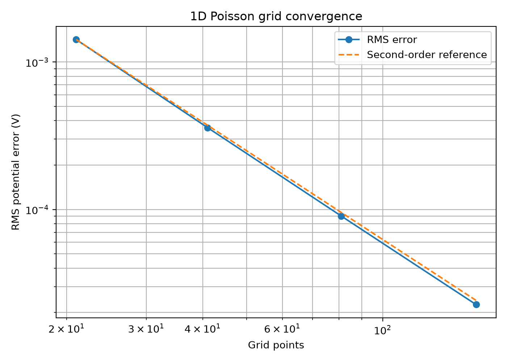

# DeviceForge


**Scientific Computing • Semiconductor Physics • Numerical Methods • High-Performance Computing • Machine Learning • Engineering Optimisation**

---

## Overview

**DeviceForge** is an open-source **Technology Computer-Aided Design (TCAD)** research framework for semiconductor device simulation.

The project explores how modern semiconductor simulation software can be developed using:

- transparent numerical methods
- rigorous verification
- modular scientific software architecture
- reproducible computational workflows
- extensible solver interfaces
- high-performance computing
- machine-learning-assisted engineering optimisation

DeviceForge is developed with a verification-first philosophy: numerical methods are implemented, tested, analytically verified where possible, and benchmarked before being treated as stable reference functionality.

The long-term objective is to build a modular research platform capable of progressing from verified electrostatics toward semiconductor transport, higher-dimensional device simulation, hardware acceleration, design optimisation, and interactive engineering workflows.

---

## Why DeviceForge?

Commercial semiconductor TCAD tools provide extremely powerful simulation capability, but the underlying numerical implementation is often opaque to the user.

DeviceForge investigates **how semiconductor simulation software is actually built**.

The project places equal emphasis on:

- numerical correctness
- scientific reproducibility
- independent verification
- software architecture
- automated testing
- transparent numerical methods
- long-term extensibility

DeviceForge is not intended to replace commercial TCAD software. Instead, it provides a focused environment for implementing, verifying, comparing, and extending selected numerical methods used in semiconductor simulation.

---

# Current Status

> **Current Development Checkpoint**
>
> DeviceForge currently contains a verified **one-dimensional electrostatic Poisson reference solver** together with an established **two-dimensional electrostatic solver architecture**.
>
> The 1D implementation is being used as the numerical reference for completing and verifying the corresponding 2D formulation before higher-level semiconductor transport physics is introduced.

The verified 1D reference solver currently supports:

- Laplace and Poisson problems
- prescribed volumetric charge density
- spatially varying relative permittivity
- heterogeneous material regions
- conservative interface treatment
- Dirichlet boundary conditions
- mixed Dirichlet-Neumann boundary conditions
- sparse matrix assembly
- dense direct solution
- sparse direct solution
- Conjugate Gradient solution
- supported preconditioning
- node-centred electrostatic postprocessing
- conservative face-centred postprocessing
- analytical verification
- manufactured-solution verification
- measured second-order grid convergence
- automated regression testing
- electrostatic visualisation

The 2D implementation has reached a controlled development checkpoint with conservative five-point assembly, harmonic face averaging, sparse matrix storage, symmetric Dirichlet treatment, analytical verification, and measured second-order convergence for smooth problems.

---

# Feature Matrix

| Capability | Status |
|---|---|
| Core grid / field / material architecture | ✅ |
| 1D Laplace solver | ✅ |
| 1D Poisson solver | ✅ |
| Spatially varying permittivity | ✅ |
| Heterogeneous dielectric interfaces | ✅ |
| Dirichlet boundary conditions | ✅ |
| Mixed Dirichlet-Neumann boundary conditions | ✅ |
| Sparse CSR matrix formulation | ✅ |
| Sparse direct solver | ✅ |
| Dense direct solver | ✅ |
| Conjugate Gradient solver | ✅ |
| Jacobi / identity preconditioning | ✅ |
| Electrostatic postprocessing | ✅ |
| Face-centred displacement analysis | ✅ |
| Manufactured-solution convergence study | ✅ |
| Verified second-order 1D convergence | ✅ |
| 2D conservative electrostatic solver | 🚧 |
| 2D verification completion | 🚧 |
| Nonlinear semiconductor electrostatics | 📋 |
| Drift-diffusion transport | 📋 |
| 3D device simulation | 📋 |
| C++ numerical backends | 📋 |
| OpenMP CPU acceleration | 📋 |
| NVIDIA CUDA acceleration | 📋 |
| AMD ROCm acceleration | 📋 |
| Distributed simulation workflows | 📋 |
| Machine-learning surrogate models | 📋 |
| Sensitivity analysis | 📋 |
| Multi-objective optimisation | 📋 |
| Interactive desktop application | 📋 |

---

# Verified 1D Poisson Reference Solver

The current reference solver evaluates the one-dimensional electrostatic Poisson equation in conservative form:

\[
-\frac{d}{dx}
\left(
\varepsilon_r(x)
\frac{d\phi}{dx}
\right)
=
\frac{\rho(x)}{\varepsilon_0}
\]

where:

- \(\phi\) is electrostatic potential
- \(\rho\) is volumetric charge density
- \(\varepsilon_0\) is the vacuum permittivity
- \(\varepsilon_r(x)\) is the spatially varying relative permittivity

The solver uses a conservative centred discretisation with harmonic averaging of permittivity at cell faces.

For an interior node \(i\):

\[
-\varepsilon_{r,i-1/2}\phi_{i-1}
+
\left(
\varepsilon_{r,i-1/2}
+
\varepsilon_{r,i+1/2}
\right)\phi_i
-
\varepsilon_{r,i+1/2}\phi_{i+1}
=
\frac{\rho_i\Delta x^2}{\varepsilon_0}.
\]

Face permittivity is calculated using:

\[
\varepsilon_{r,i+1/2}
=
\frac{
2\varepsilon_{r,i}\varepsilon_{r,i+1}
}{
\varepsilon_{r,i}+\varepsilon_{r,i+1}
}.
\]

This treatment preserves conservative electrostatic flux across discontinuous dielectric interfaces.

Detailed numerical documentation is available in:

```text
docs/poisson_solver.md
```

---

# Numerical Verification

Verification is treated as a core part of DeviceForge development rather than as a final validation step.

The current 1D Poisson reference solver has been tested against:

- analytical Laplace solutions
- analytical uniform-charge Poisson solutions
- heterogeneous dielectric stacks
- electric-displacement continuity
- mixed Dirichlet-Neumann analytical solutions
- charged mixed-boundary analytical solutions
- outward-normal Neumann sign conventions
- matrix symmetry
- matrix positive definiteness
- sparse direct solution
- Conjugate Gradient solution
- manufactured-solution grid convergence
- postprocessing regression tests
- visualisation regression tests

---

## Manufactured-Solution Grid Convergence

A smooth manufactured solution is used to measure formal spatial convergence:

\[
\phi(x)
=
\sin\left(
\frac{\pi x}{L}
\right).
\]

The corresponding charge density is:

\[
\rho(x)
=
\varepsilon_0
\varepsilon_r
\left(
\frac{\pi}{L}
\right)^2
\sin\left(
\frac{\pi x}{L}
\right).
\]

The measured RMS potential errors are:

| Grid points | RMS error | Error ratio | Observed order |
|---:|---:|---:|---:|
| 21 | 1.420642634989e-03 | - | - |
| 41 | 3.591331920374e-04 | 3.955754 | 1.983953 |
| 81 | 9.031491950553e-05 | 3.976455 | 1.991483 |
| 161 | 2.264743183942e-05 | 3.987866 | 1.995617 |

The observed order approaches:

\[
p=2
\]

confirming second-order spatial convergence for the verified 1D reference formulation.



The complete verification study is available at:

```text
examples/verification/poisson_1d_grid_convergence.py
```

---

# Mixed Dirichlet-Neumann Verification

The 1D reference solver supports:

```text
Dirichlet + Dirichlet
Dirichlet + Neumann
Neumann   + Dirichlet
```

Neumann values are interpreted as outward-normal potential derivatives:

\[
\frac{\partial\phi}{\partial n}=g.
\]

In one dimension:

\[
g_L=-\frac{d\phi}{dx}
\]

at the left boundary and:

\[
g_R=+\frac{d\phi}{dx}
\]

at the right boundary.

Charged mixed-boundary problems include the correct endpoint half-cell source contribution and are verified against analytical quadratic solutions.

A standalone example is provided at:

```text
examples/electrostatics/mixed_boundary_1d.py
```

---

# Heterogeneous Dielectric Verification

DeviceForge supports spatially varying material permittivity.

At an uncharged dielectric interface, normal electric displacement should remain continuous:

\[
D_n
=
\varepsilon_0
\varepsilon_r
E_n.
\]

The conservative face formulation is used to verify displacement continuity across dielectric interfaces.

A representative example is:

```text
examples/electrostatics/dielectric_stack_1d.py
```

---

# Linear Algebra

The electrostatic solver is intentionally separated from the linear-algebra implementation.

The Poisson solver assembles:

\[
A\phi=b
\]

and delegates the system to a solver satisfying a common linear-solver interface.

Current implementations include:

- `DenseDirectSolver`
- `SparseDirectSolver`
- `ConjugateGradientSolver`

Supported preconditioning includes:

- `IdentityPreconditioner`
- `JacobiPreconditioner`

The assembled Poisson matrix is stored in sparse CSR format.

Dirichlet conditions are applied using symmetric elimination so that matrix symmetry is preserved. Supported mixed-boundary systems are also verified to remain symmetric positive definite, enabling Conjugate Gradient solution.

---

# Electrostatic Postprocessing

The current electrostatic analysis layer includes:

- electrostatic potential
- node-centred electric field
- electric displacement
- electrostatic energy density
- face-centred electric field
- face-centred relative permittivity
- face-centred electric displacement

The node-centred electric field is calculated using second-order centred interior differences and second-order one-sided endpoint differences where sufficient grid points are available.

The face-centred quantities are particularly useful for analysing conservative behaviour across heterogeneous material interfaces.

---

# Visualisation

DeviceForge includes scientific plotting functions for:

- electrostatic potential
- electric field
- electric displacement
- electrostatic energy density
- relative permittivity
- solver residual history
- face-centred electric displacement

Face-centred displacement visualisation includes stable handling for effectively constant conservative flux so that floating-point roundoff is not visually exaggerated.

---

# Two-Dimensional Electrostatics

A separate two-dimensional electrostatic solver architecture has already been established.

The current 2D checkpoint includes:

- structured Cartesian grids
- conservative five-point discretisation
- heterogeneous relative permittivity
- harmonic face averaging
- sparse CSR assembly
- symmetric Dirichlet elimination
- configurable linear solvers
- full outer Dirichlet boundaries
- spatially varying boundary values
- 2D postprocessing
- 2D visualisation
- analytical verification
- manufactured-solution convergence testing

Development is intentionally paused at this checkpoint while the 1D solver is completed and frozen as the numerical reference implementation.

The next major development stage is to apply the verified 1D numerical conventions systematically to the existing 2D architecture and complete the corresponding verification suite.

---

# Software Architecture

DeviceForge is designed around separation of responsibilities.

```text
Simulation
    │
    ▼
SimulationRuntime
    │
    ▼
SolverProtocol
    │
    ▼
Concrete Solver
    │
    ▼
SimulationResult
    │
    ▼
RuntimeState
```

The immutable `Simulation` object defines the problem.

`SimulationRuntime` coordinates execution and mutable runtime state.

Concrete solvers operate only on simulation definitions and return `SimulationResult` objects.

Higher-level workflows delegate execution to the runtime layer and analysis to postprocessing components.

This separation is intended to make physics solvers easier to test, replace, benchmark, and extend.

---

# Core Components

## Grid

Defines computational dimension, shape, spacing, and coordinates.

## Field

Represents physical quantities defined over a grid.

## FaceField

Represents quantities collocated between neighbouring grid nodes.

## Material

Stores physical material properties such as relative permittivity.

## Region

Associates portions of the computational domain with material definitions.

## Device

Aggregates regions and provides material-property fields across the computational domain.

## Boundary Condition

Represents prescribed simulation boundary information, including scalar and spatially varying values.

## Simulation

Stores the immutable definition of a numerical problem.

## Simulation Result

Stores solved fields, convergence information, residual histories, runtime, backend information, and numerical metadata.

## Workflow

Provides higher-level orchestration for simulation execution, analysis, and postprocessing.

---

# Project Structure

The repository is organised into modular scientific software components:

```text
DeviceForge/
├── src/
│   └── deviceforge/
│       ├── core/
│       ├── geometry/
│       ├── physics/
│       ├── solvers/
│       ├── postprocessing/
│       ├── visualisation/
│       └── linalg/
│
├── tests/
├── examples/
├── benchmarks/
├── docs/
└── README.md
```

The exact repository structure evolves as new capabilities are introduced.

---

# Examples

Representative current examples include:

```text
examples/electrostatics/dielectric_stack_1d.py
examples/electrostatics/mixed_boundary_1d.py
examples/verification/poisson_1d_grid_convergence.py
examples/electrostatics/laplace_2d.py
examples/electrostatics/sinusoidal_laplace_2d.py
```

These examples are intended to demonstrate both numerical capability and verification methodology.

---

# Documentation

Technical documentation is located in:

```text
docs/
```

Current documentation includes:

- `architecture.md`
- `benchmarking.md`
- `examples.md`
- `mathematics.md`
- `poisson_solver.md`
- `solver_design.md`

The 1D Poisson reference-solver specification is documented in:

```text
docs/poisson_solver.md
```

---

# Quick Start

Clone the repository:

```bash
git clone https://github.com/John-McKay-Engineering-Research/DeviceForge.git
cd DeviceForge
```

Create a virtual environment:

```bash
python -m venv venv
```

Windows:

```powershell
venv\Scripts\activate
```

Linux/macOS:

```bash
source venv/bin/activate
```

Install DeviceForge in editable mode:

```bash
pip install -e .
```

Run the automated test suite:

```bash
python -m pytest -v
```

Run the 1D manufactured-solution verification example:

```bash
python examples/verification/poisson_1d_grid_convergence.py
```

Run the mixed-boundary example:

```bash
python examples/electrostatics/mixed_boundary_1d.py
```

---

# Design Philosophy

DeviceForge follows a verification-first engineering philosophy.

Core principles include:

- numerical correctness before optimisation
- verification before performance
- transparent numerical methods
- modular architecture
- scientific reproducibility
- automated testing
- extensible interfaces
- incremental development
- meaningful regression coverage

A numerical feature should not be considered complete until it is accompanied by appropriate:

- implementation tests
- regression tests
- analytical or manufactured verification
- documentation
- representative examples

---

# Verification and Validation

Verification asks:

> **Are the equations being solved correctly?**

Current verification approaches include:

- analytical solutions
- manufactured solutions
- grid-convergence studies
- conservation checks
- matrix-property checks
- residual monitoring
- independent solver comparisons
- automated regression testing

Validation asks:

> **Are the equations and models appropriate for the intended physical problem?**

As DeviceForge progresses into more complete semiconductor-device physics, validation will increasingly involve:

- published benchmark problems
- academic literature
- experimentally measured behaviour
- cross-comparison with established simulation tools where appropriate

---

# Development Roadmap

Development follows a staged numerical-verification strategy.

```text
Verified 1D electrostatic reference solver
        ↓
Complete and verify 2D electrostatics
        ↓
Semiconductor electrostatics
        ↓
Self-consistent carrier physics
        ↓
Drift-diffusion transport
        ↓
2D semiconductor transport
        ↓
3D device simulation
        ↓
High-performance backends
        ↓
Interactive application
        ↓
Design-space exploration and optimisation
```

## Near-Term

Current priorities are:

- freeze the verified 1D electrostatic reference solver
- complete equivalent 2D numerical behaviour
- verify 2D convergence and heterogeneous-interface behaviour
- strengthen solver documentation
- maintain regression coverage

## Medium-Term

Planned developments include:

- nonlinear semiconductor electrostatics
- carrier statistics
- electron and hole continuity equations
- Scharfetter-Gummel transport discretisation
- recombination models
- drift-diffusion transport
- bias stepping
- current extraction
- nonlinear convergence control

## Long-Term

The long-term direction includes:

- three-dimensional device simulation
- gate-all-around transistor examples
- electro-thermal coupling
- modern C++ solver backends
- OpenMP CPU acceleration
- NVIDIA CUDA
- AMD ROCm
- distributed simulation campaigns
- desktop graphical interface
- project-management workflows
- sensitivity analysis
- surrogate modelling
- multi-objective optimisation

---

# High-Performance Computing

DeviceForge is designed so that numerical physics can eventually be separated from hardware-specific execution.

Potential future execution backends include:

- Python / NumPy reference implementations
- modern C++
- OpenMP
- NVIDIA CUDA
- AMD ROCm
- distributed-memory computing

Reference implementations are expected to remain readable and verifiable even when accelerated implementations are introduced.

Performance improvements should not be accepted unless they preserve verified physical and numerical behaviour.

---

# Machine Learning and Engineering Optimisation

Later DeviceForge stages are intended to explore simulation-assisted device optimisation.

Potential capabilities include:

- design of experiments
- Latin hypercube sampling
- sensitivity analysis
- surrogate modelling
- Bayesian optimisation
- multi-objective genetic algorithms
- Pareto-front analysis
- automated design-space exploration

Machine-learning methods are intended to complement first-principles simulation rather than replace it.

---

# Limitations

DeviceForge is an independent research and engineering software project.

It is not intended to:

- replace commercial semiconductor TCAD platforms
- provide fabrication-qualified device predictions
- reproduce proprietary physical models
- model every semiconductor transport mechanism
- provide industrial process simulation at the current stage

Results must be interpreted within the assumptions and verification status of each implemented model.

The currently verified reference solver is specifically a **linear 1D electrostatic Poisson solver**. Higher-order semiconductor transport capabilities remain part of later development stages.

---

# Software Quality

The project aims to follow modern scientific software engineering practices including:

- type hints
- modular design
- unit testing
- regression testing
- numerical verification
- scientific reproducibility
- consistent SI units
- explicit solver metadata
- clear documentation
- incremental Git development
- meaningful commit history

Correctness and maintainability are prioritised over premature optimisation.

---

# Contributing

Contributions are welcome.

Areas of particular interest include:

- numerical methods
- semiconductor physics
- scientific computing
- sparse linear algebra
- verification
- testing
- visualisation
- performance optimisation
- documentation

When contributing:

1. create a feature branch
2. include tests where appropriate
3. document new functionality
4. verify numerical correctness
5. submit a pull request

---

# Citation

A formal citation and DOI will be added when DeviceForge reaches a stable public release.

Until then, the repository may be referenced as:

```text
McKay, J.
DeviceForge: An Open-Source Semiconductor TCAD Research Framework.
GitHub, 2026.
```

---

# Recommended Reading

References that influence the numerical and scientific direction of DeviceForge include:

- Selberherr — *Analysis and Simulation of Semiconductor Devices*
- Sze & Ng — *Physics of Semiconductor Devices*
- Lundstrom — *Fundamentals of Carrier Transport*
- Press et al. — *Numerical Recipes*
- Saad — *Iterative Methods for Sparse Linear Systems*

---

# Licence

DeviceForge is released under the MIT License.

See:

```text
LICENSE
```

for complete licensing information.

---

# Acknowledgements

DeviceForge draws inspiration from research in:

- semiconductor device physics
- numerical analysis
- scientific computing
- high-performance computing
- optimisation
- open-source engineering software

The project also builds on experience in computational engineering, numerical simulation, optimisation, automated simulation workflows, and scientific software development.

---

# Contact

Project repository:

```text
https://github.com/John-McKay-Engineering-Research/DeviceForge
```

Issues, feature requests, and discussions are welcome through the GitHub repository.

---

DeviceForge will continue to evolve incrementally, with new numerical capabilities promoted to stable reference functionality only after they have been implemented, tested, documented, and verified.
